<div align="center">
  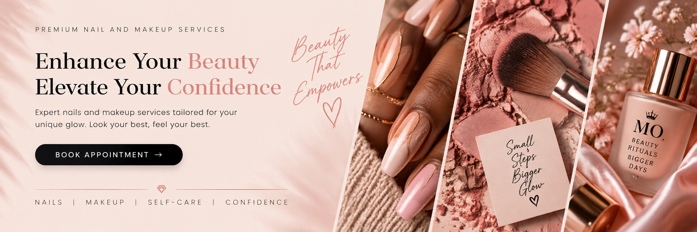
</div>

<br>

# 💅 Mo Salon

### Full-Stack Nail & Makeup Booking Platform

Mo Salon is a full-stack beauty booking web application designed for a nail and makeup business. The platform allows customers to explore services, create accounts, book appointments, review booking details and interact with the business through a polished, responsive interface.

The project combines a modern Angular front end with an ASP.NET Core backend and SQL Server database.

<br>

## ✨ Project Overview

Mo Salon was created to provide a complete digital experience for a beauty-service business.

The application focuses on:

- Customer registration and authentication
- Service discovery
- Appointment booking
- Booking review and confirmation
- Payment-flow interface
- Gallery browsing
- Contact and business information
- Responsive, beauty-focused UI design
- Structured full-stack architecture

<br>

## 🛠️ Tech Stack

<table>
<tr>

<td align="center">

<br>
<sub><b>Angular</b></sub>
</td>

<td align="center">

<br>
<sub><b>TypeScript</b></sub>
</td>

<td align="center">

<br>
<sub><b>ASP.NET Core</b></sub>
</td>

<td align="center">

<br>
<sub><b>C#</b></sub>
</td>

<td align="center">

<br>
<sub><b>SQL Server</b></sub>
</td>

<td align="center">

<br>
<sub><b>Docker</b></sub>
</td>

<td align="center">

<br>
<sub><b>Azure</b></sub>
</td>

</tr>
</table>

<br>

## 🌸 Application Preview

### 🏠 Landing Page

The landing page introduces the Mo Salon brand, highlights available beauty services and provides customers with a clear path to booking an appointment.

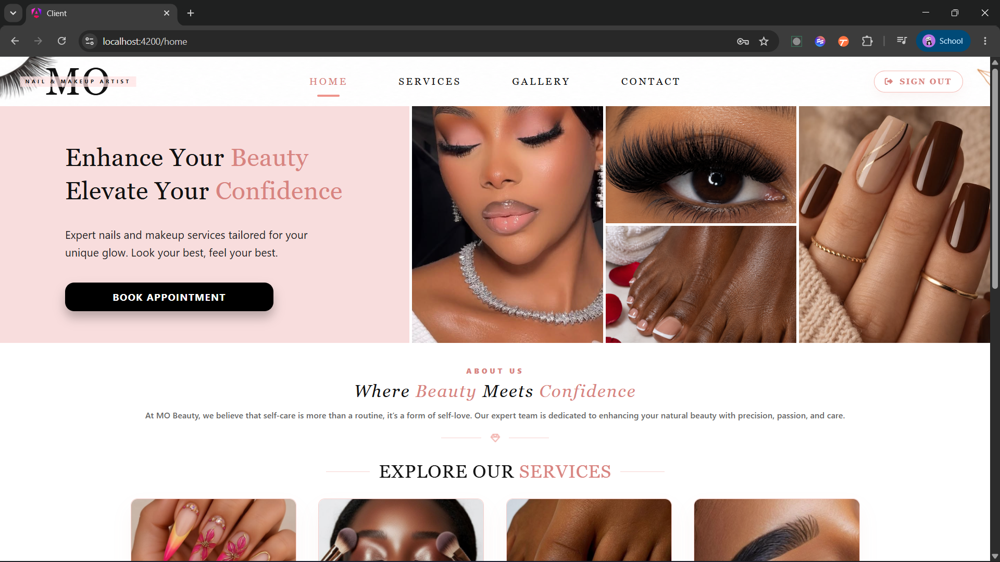

<br>

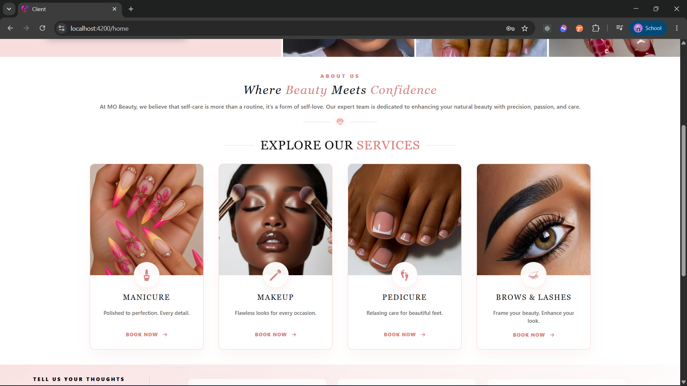

<br>

## 🔐 Authentication

Customers can create an account and sign in before managing appointments and bookings.

<table>
<tr>

<td width="50%" valign="top">

<h4>Sign In</h4>

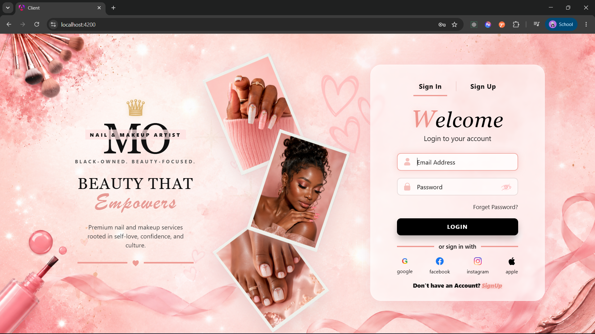

</td>

<td width="50%" valign="top">

<h4>Sign Up</h4>

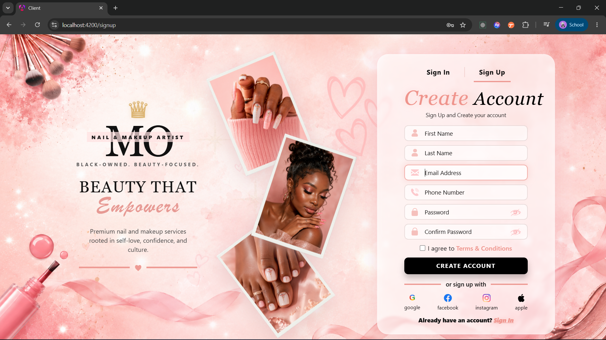

</td>

</tr>
</table>

<br>

## 📅 Booking Experience

The booking workflow guides customers through selecting services, reviewing booking details, payment and final confirmation.

### Appointment Booking

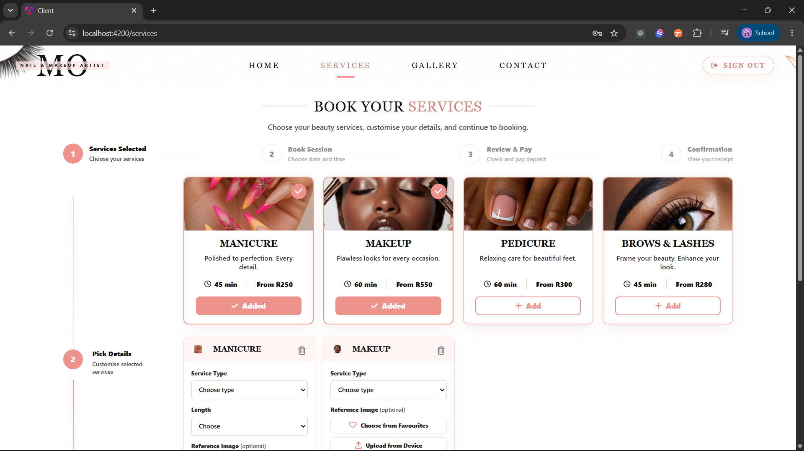

<br>

### Booking Details

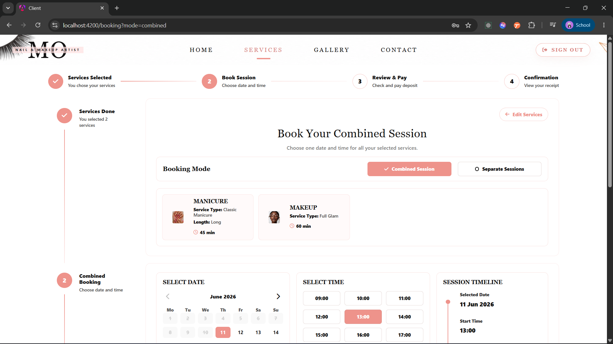

<br>

### Review Booking

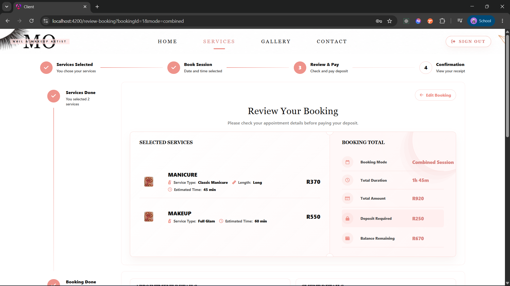

<br>

### Payment

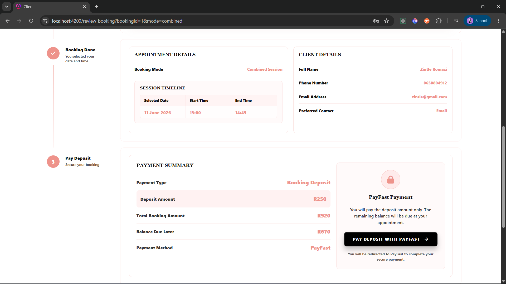

<br>

### Booking Confirmation

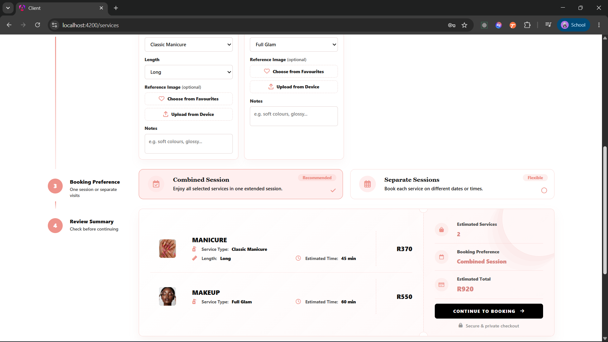

<br>

## 🖼️ Gallery

The gallery allows customers to browse beauty inspiration and examples of nail, makeup and other beauty services.

<table>
<tr>

<td width="50%" valign="top">

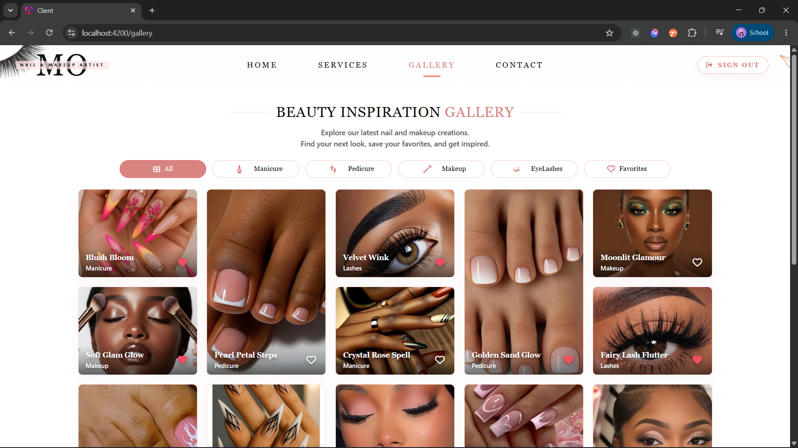

</td>

<td width="50%" valign="top">

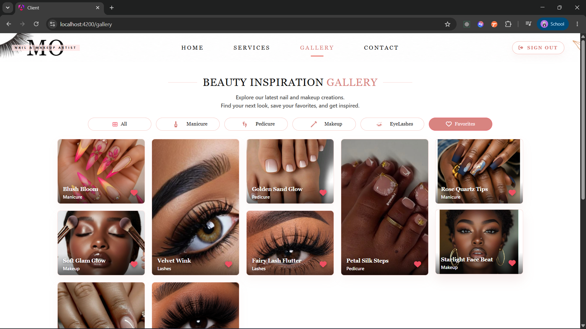

</td>

</tr>
</table>

<br>

## 📞 Contact & Business Information

The contact section provides customers with ways to reach the business and view important salon information.

<table>
<tr>

<td width="50%" valign="top">

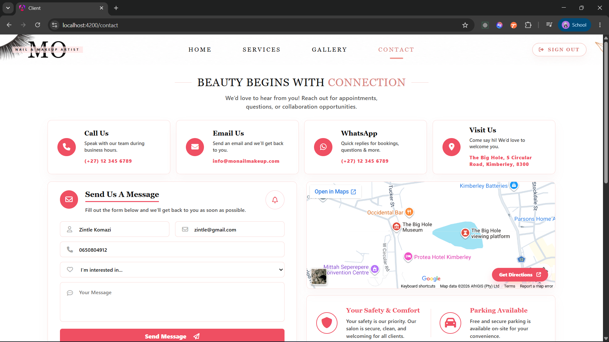

</td>

<td width="50%" valign="top">

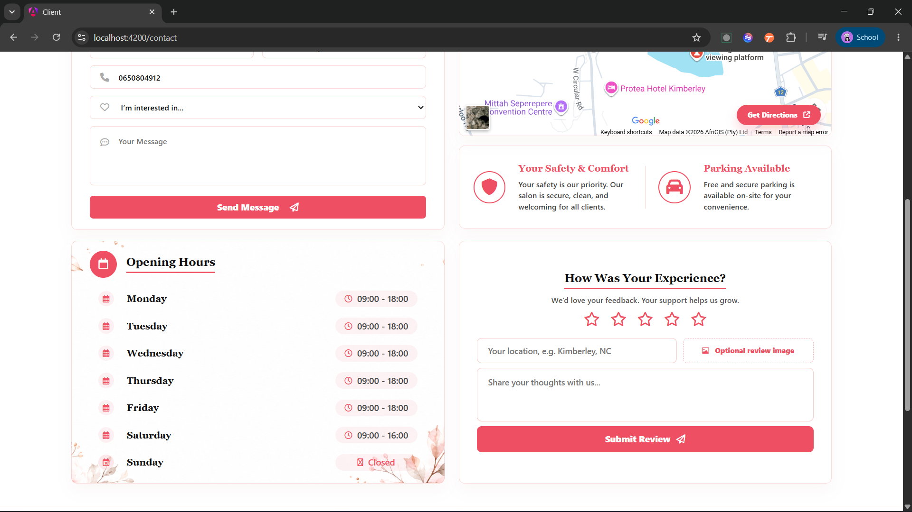

</td>

</tr>
</table>

<br>

### Footer

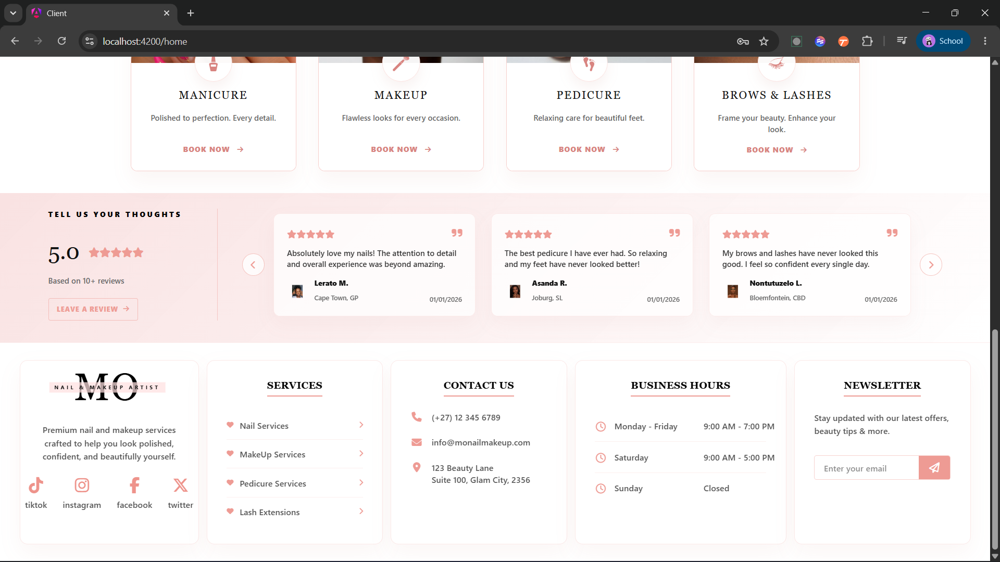

<br>

## ⭐ Key Features

- User registration and authentication
- Responsive customer-facing landing page
- Beauty-service browsing
- Appointment booking workflow
- Booking review and confirmation
- Payment-flow interface
- Gallery browsing
- Contact and business-information pages
- Sign-out functionality
- Angular frontend connected to an ASP.NET Core backend
- SQL Server data persistence
- Docker configuration
- Azure deployment preparation

<br>

## 🏗️ Project Architecture

```text
Angular Client
      │
      │ HTTP / REST
      ▼
ASP.NET Core API
      │
      │ Entity Framework Core
      ▼
SQL Server Database
```

<br>

## 📁 Project Structure

```text
mosalondraft/
│
├── API/                  # ASP.NET Core backend
│
├── client/               # Angular frontend
│
├── screenshots/          # Project screenshots and README assets
│
├── .gitignore
│
├── docker-compose.yml    # Docker configuration
│
├── MoSalonDraft.sln      # .NET solution
│
└── README.md
```

<br>

## 🚀 Getting Started

### Prerequisites

Make sure the following tools are installed:

- .NET SDK
- Node.js
- npm
- Angular CLI
- SQL Server
- Git

### 1. Clone the Repository

```bash
git clone https://github.com/komazidevzbe-lab/mosalondraft.git
```

Navigate into the project:

```bash
cd mosalondraft
```

### 2. Run the Backend

Navigate to the API project:

```bash
cd API
```

Restore the required packages:

```bash
dotnet restore
```

Run the backend:

```bash
dotnet run
```

### 3. Run the Angular Client

Open another terminal and navigate to the client:

```bash
cd client
```

Install dependencies:

```bash
npm install
```

Start the Angular development server:

```bash
ng serve
```

Then open:

```text
http://localhost:4200
```

<br>

## 📌 Project Status

Mo Salon is currently maintained as a portfolio project.

The previous Azure deployment is no longer active, so the application is currently demonstrated through the screenshots included in this repository.

The source code remains available for reviewing the application's frontend, backend, database integration and overall architecture.

<br>

## 💡 What I Learned

Through the development of Mo Salon, I gained practical experience with:

- Building a full-stack application using Angular and ASP.NET Core
- Connecting frontend functionality to REST API endpoints
- Working with SQL Server and Entity Framework Core
- Structuring customer authentication workflows
- Designing multi-step booking experiences
- Building responsive and user-focused interfaces
- Organising larger applications into frontend and backend layers
- Using Git and GitHub for version control
- Preparing applications for Docker-based environments
- Preparing a full-stack application for Azure deployment
- Debugging and refining real-world application flows
- Designing software around an actual business use case

<br>

## 🎯 Project Purpose

Mo Salon was developed as a practical full-stack project to demonstrate how modern web technologies can be used to digitise the customer experience of a service-based business.

The project combines software development, database management, user experience design and business-focused problem solving into one complete application.

<br>

## 👩🏽‍💻 Author

**Zintle Elsie Komazi**

Junior Software Developer | Aspiring Data Analyst

<a href="https://github.com/komazidevzbe-lab">
  
</a>

<a href="https://www.linkedin.com/in/zbekomazi232">
  
</a>

<a href="mailto:komazi.job@gmail.com">
  
</a>

<a href="https://portfolio-zbe-app-drhbcfa8f0a7etgq.southafricanorth-01.azurewebsites.net/">
  
</a>

<br><br>

<p align="center">
  <b>Beauty • Technology • User Experience</b>
</p>
